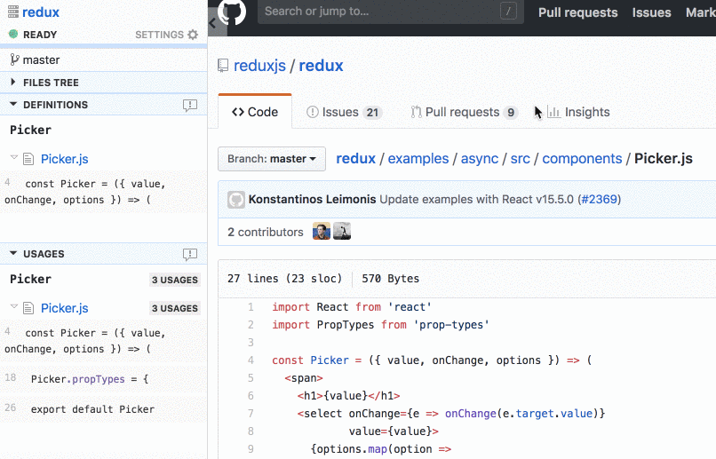
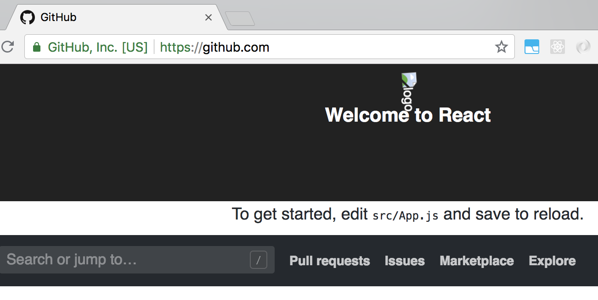

We build [Rubberduck](/), a browser extension that adds IDE features (find usages, definitions, files tree) to GitHub web pages. Our users use it to read and review code faster on the web. We built Rubberduck on React, and we wanted to share our **create-react-app** setup for extension projects.

Like most React projects, we started with [create-react-app](https://github.com/facebook/create-react-app) (CRA) because of the **developer experience**. Many of those gains do not apply directly to extensions: for example, hot reloading does not work. In this tutorial, we share our solutions to these problems, so that you can build an extension that is joyful to develop on.



Our design goals were to build on top of CRA, and (one-time) update project configuration to speed up the ongoing development effort. At the end of the tutorial below, we will have a browser extension that is:

* Built on create-react-app, without [ejecting](https://github.com/facebook/create-react-app/blob/master/packages/react-scripts/template/README.md#npm-run-eject)
* Development mode with near-hot reloading on `npm start`
* Production builds with `npm run build`

While we use Chrome for illustration, the the [Web Extensions API](https://developer.mozilla.org/en-US/Add-ons/WebExtensions) makes extensions portable to Firefox and other browsers.

## Extension architecture

Browser extensions can have [multiple components](https://developer.chrome.com/extensions/overview#arch), and in this post we will focus on [content scripts](https://developer.chrome.com/extensions/content_scripts): JS scripts that run in the context of other web pages. These are good candidates for React development because they can have sophisticated UI requirements. Rubberduck runs as a content script inside GitHub pages: it inserts a `<div>` element that renders a sidebar on the left.

## Starting with CRA

To kick start our project, let's use CRA. The code for this tutorial is available at [this repo](https://github.com/karigari/my-react-extension).

```
npx create-react-app my-demo-extension
cd my-demo-extension
npm start
```

At this point, if you open `http://localhost:3000/`, you will see the spinning React logo. Our basic React app is setup. When this code is used in the extension, it needs to update the host web page DOM to make space for itself. To do this, we will update the `render` code in `src/index.js` file to create a `div` element.

```javascript
const anchor = document.createElement('div');
anchor.id = 'extension-root';
document.body.insertBefore(anchor, document.body.childNodes[0]);

ReactDOM.render(<App />, document.getElementById('extension-root'));
```

## Making it an extension

To make our project work as an extension, we will update the `public` directory. Specifically, we will add `background.js` and make changes to the `manifest.json` file.

```
└── public
    ├── favicon.ico
    ├── index.html
    ├── manifest.json
    └── background.js
```

The [extension manifest file](https://developer.chrome.com/extensions/manifest) defines extension properties, and sets `background.js` as the background page. This page will inject our React app programmatically on GitHub pages.

```json
{
  "name": "my-demo-extension",
  "version": "0.1.0",
  "background": {
    "persistent": false,
    "scripts": ["background.js"]
  },
  "permissions": ["https://github.com/*"],
  "manifest_version": 2
}
```

## Development mode

CRA's development mode uses the [Webpack dev server](https://github.com/webpack/webpack-dev-server), which enables an amazing live reloading experience. This eliminates the need to reload the app in your browser. Similarly for an browser extension, we want to eliminate reloading the extension from the `chrome://extensions` page. New code should be automatically lifted by the browser for subsequent script injections.[^1]

The basic change here is to force the dev server to write hot reloading changes to disk, from where the browser will pick them up. This is possible with the [write-file-webpack-plugin](https://github.com/gajus/write-file-webpack-plugin). To add this plugin, we will use [react-app-rewired](https://github.com/timarney/react-app-rewired).

```
npm install --save-dev react-app-rewired write-file-webpack-plugin
```

Post install, we create a `config-overrides.js` file in our project directory, with the following contents.

```javascript
const path = require('path');
const WriteFilePlugin = require('write-file-webpack-plugin');
const fs = require('fs-extra');

module.exports = function override(config, env) {
  let buildPath = './build';

  config.output.path = path.join(__dirname, buildPath);
  config.plugins.push(new WriteFilePlugin());
  fs.removeSync(buildPath);
  fs.copySync('./public/', buildPath);

  return config;
};
```

We will also have to change our script commands inside `package.json` to use `react-app-rewired`.

```json
"scripts": {
  "start": "react-app-rewired start",
  "build": "react-app-rewired build",
  "test": "react-app-rewired test --env=jsdom",
  "eject": "react-app-rewired eject"
}
```

## React app as content script

We can now update the `background.js` file to use the React file as the content script, with the `executeScript` API. The dev server outputs the JS file at `static/js/bundle.js`.

```javascript
const jsLocation = 'static/js/bundle.js';

chrome.tabs.onUpdated.addListener((tabId, changeInfo, tab) => {
  if (changeInfo.status === 'complete' && jsLocation !== null) {
    chrome.tabs.executeScript(tabId, {
      file: jsLocation,
      runAt: 'document_end',
    });
  }
});
```

Post this change, run the start command, and reload once on `chrome://extensions`. Now when you change your React code, changes will get auto-compiled, and new GitHub web pages will pick them up. Our `<div>` is injected at the top of the GitHub page.



## Production mode

The production build command require some more changes. This is because the `npm run build` output is located elsewhere, and it generates separate JS/CSS files.

To handle this, we will create a new build script `build-script.js` that will modify asset locations inside `background.js`. See [updated background.js](https://github.com/karigari/my-react-extension/blob/master/public/background.js).

```javascript
const fs = require('fs-extra');

const updateBackgroundFile = buildPath => {
  const backgroundJS = `${buildPath}/background.js`;
  const assetManifest = `${buildPath}/asset-manifest.json`;
  const assetContents = JSON.parse(fs.readFileSync(assetManifest, 'utf8'));

  const jsPlaceholder = 'const jsLocation = "./static/js/bundle.js";';
  const cssPlaceholder = 'const cssLocation = null;';

  const jsLocation = `const jsLocation = "./${assetContents['main.js']}";`;
  const cssLocation = `const cssLocation = "./${assetContents['main.css']}";`;

  let backgroundContents = fs.readFileSync(backgroundJS, 'utf8');
  backgroundContents = backgroundContents.replace(jsPlaceholder, jsLocation);
  backgroundContents = backgroundContents.replace(cssPlaceholder, cssLocation);

  // Write back the corrected script
  fs.writeFile(backgroundJS, backgroundContents, function(err) {
    if (err) {
      return console.log(err);
    }
    console.log('background.js updated.');
  });
};

module.exports = {
  updateBackgroundFile: updateBackgroundFile,
};

if (require.main === module) {
  const buildPath = './build';
  updateBackgroundFile(buildPath);
}
```

And finally, we update the npm build command to run the new script file. The CRA build command can now generate extension production builds, that can be zipped and uploaded to the Chrome Store.

```json
"build": "react-app-rewired build && node build-script.js"
```

## Conclusion

This way, you can use **create-react-app** for a browser extension setup, without ejecting the code. While your needs and design goals might be different, our configuration setup has served us well so far. The configuration has evolved to handle multiple environments, facilitate testing by pinning extension identifiers, and also uploading sourcemaps for better crash reporting. We would love to share more of those learnings in the future.

How are you building your browser extensions? We would love to know!

[^1]:

  The [react-chrome-extension-boilerplate](https://github.com/jhen0409/react-chrome-extension-boilerplate) repo implements "true hot reloading" on a content script by injecting an `<iframe>`. Such scripts can no longer interact with the host DOM, and in our opinion is a sub-optimal experience. It might work for some projects, so do check it out.
