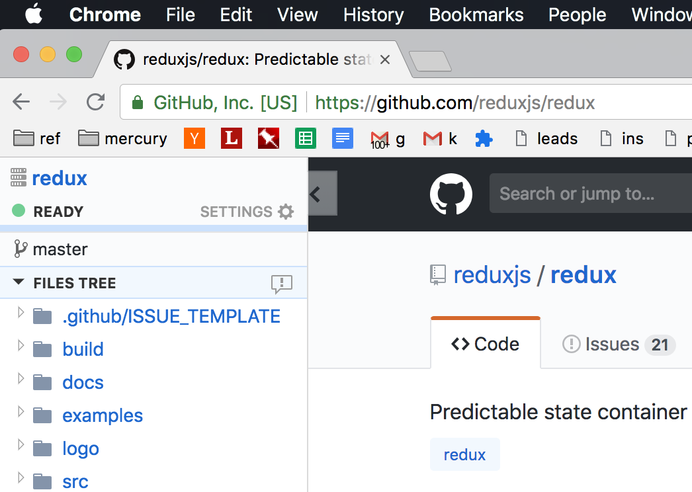
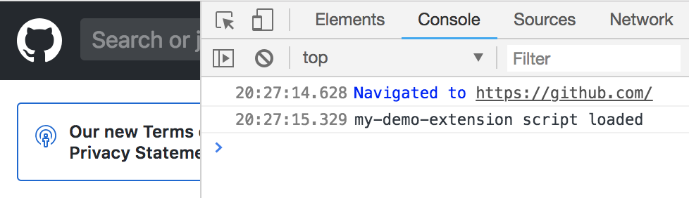

We build [Rubberduck](/), a browser extension that adds IDE features (find usages, definitions, files tree) to GitHub web pages. It makes easier to understand code, and our users use it to read and review code faster. We built Rubberduck on React, and want to share our learnings in the post.

Like most React projects, we started with [create-react-app](https://github.com/facebook/create-react-app) (CRA) because _it just works_, and works great. CRA drastically improves the **developer experience** of building React apps, but many of those gains do not apply directly to extensions. For example, hot reloading does not work. In this post, we share our solutions to these problems, so that you can build an extension that is a joy to develop on.

Unlike other posts on this topic, this one focuses on building proper development and production pipeline for your code. At the end of the post, we will have a browser extension that is:

* Built on create-react-app, without [ejecting](https://github.com/facebook/create-react-app/blob/master/packages/react-scripts/template/README.md#npm-run-eject)
* Development mode with near-hot reloading on `npm start`
* Production builds with `npm run build`

While this tutorial uses Chrome for illustration, the extension will be portable to Firefox and other browsers with the [Web Extension API](https://developer.mozilla.org/en-US/Add-ons/WebExtensions).



## Extension architecture

Browser extensions can have [multiple components](https://developer.chrome.com/extensions/overview#arch), and in this post we will focus on [content scripts](https://developer.chrome.com/extensions/content_scripts). Content scripts are scripts that run in the context of web pages. These are good candidates for React development because they can have complicated UI requirements. Rubberduck runs as a content script inside GitHub pages. It inserts a `div` element that renders a sidebar on the left.

## Start with React

To kick start the tutorial, let's use CRA to create a new React project. The code for this tutorial is available at [this repo](https://github.com/karigari/my-react-extension).

```
npx create-react-app my-demo-extension
cd my-demo-extension
yarn start
```

At this point, if you open `http://localhost:3000/`, you will see the spinning React logo. Our basic React app is setup.

When this app is used in the extension, it needs to update the host web page DOM to make space for itself. To do this, we will update the `render` code in `src/index.js` file to create a `div` element.

```javascript
const anchor = document.createElement('div');
anchor.id = 'extension-root';
document.body.insertBefore(anchor, document.body.childNodes[0]);

ReactDOM.render(<App />, document.getElementById('extension-root'));
```

## Make it an extension

To make our project work as an extension, we will update the `public` directory. Specifically, we will add `contentScript.js` and make changes to the `manifest.json` file.

```
└── public
    ├── favicon.ico
    ├── index.html
    ├── manifest.json
    └── background.js
```

In the `contentScript.js` file, we will add a simple log for now. This is a placeholder to make sure the extension is setup correctly. In the following steps we will replace it with the React app.

```javascript
console.log('my-demo-extension script loaded');
```

The [extension manifest](https://developer.chrome.com/extensions/manifest) declares the content script file to be loaded on all GitHub web pages. You can use a [different implementation](https://developer.chrome.com/extensions/content_scripts#declaratively) here.

```json
{
  "name": "my-demo-extension",
  "version": "0.1.0",
  "background": {
    "persistent": false,
    "scripts": ["background.js"]
  },
  "permissions": ["https://github.com/*"],
  "manifest_version": 2
}
```

## First run

It's time to test the extension. Let's create a build and load that into Chrome.

```
npm run build
```

This will setup a `build/` directory in the project. Load this directory as an [unpacked extension](https://developer.chrome.com/extensions/getstarted) inside Chrome. When we navigate to a GitHub.com page, we will find the `console.log`.



Creating a production build and reloading the extension will get tedious pretty soon for development, and the next step will fix that for you.

## Development mode

CRA's development mode uses the [Webpack dev server](https://github.com/webpack/webpack-dev-server), which enables an amazing live reloading experience. This eliminates the need to reload the app in your browser. Similarly for an browser extension, we want to implement hot reloading to eliminate reloading the extension from the `chrome://extensions` page.[^1]

The basic change here is to make the dev server to write hot reloading changes to disk, from where Chrome will pick them work. This is possible with the [write-file-webpack-plugin](https://github.com/gajus/write-file-webpack-plugin). We will use [react-app-rewired](https://github.com/timarney/react-app-rewired) to add this plugin.

```
npm install --save-dev react-app-rewired write-file-webpack-plugin
```

Post install, we create a `config-overrides.js` file in our project directory, with the following contents.

```javascript
const path = require('path');
const WriteFilePlugin = require('write-file-webpack-plugin');
const fs = require('fs-extra');

module.exports = function override(config, env) {
  let buildPath = './build';

  config.output.path = path.join(__dirname, buildPath);
  config.plugins.push(new WriteFilePlugin());
  fs.removeSync(buildPath);
  fs.copySync('./public/', buildPath);

  return config;
};
```

We will also have to change our script commands inside `package.json` to use `react-app-rewired`.

```json
"scripts": {
  "start": "react-app-rewired start",
  "build": "react-app-rewired build",
  "test": "react-app-rewired test --env=jsdom",
  "eject": "react-app-rewired eject"
}
```

## Run with React

With the plugins in place, we can update the `background.js` file to use the React file.

```javascript
const jsLocation = 'static/js/bundle.js';

chrome.tabs.onUpdated.addListener((tabId, changeInfo, tab) => {
  if (changeInfo.status === 'complete' && jsLocation !== null) {
    chrome.tabs.executeScript(tabId, {
      file: jsLocation,
      runAt: 'document_end',
    });
  }
});
```

Post this change, run the start command, and reload the code once on `chrome://extensions`. Post this, your React code changes will get auto-compiled, and new GitHub web pages will have the latest changes. No more extension reloading!

```
npm start
```


## Production mode

While development mode is sorted, production builds require some more changes. This is because the `npm run build` output is located elsewhere, and it generates separate JS/CSS files.

To handle this and the development mode case together, we will create a new script that will modify asset locations inside `background.js`.

```javascript
const jsLocation = JS_ASSET_LOCATION;
const cssLocation = CSS_ASSET_LOCATION;
```

Create a new file `build-script.js` inside the project directory, with the following contents.

```javascript
const fs = require('fs-extra');

const updateBackgroundFile = buildPath => {
  const backgroundJS = `${buildPath}/background.js`;
  const assetManifest = `${buildPath}/asset-manifest.json`;
  const assetContents = JSON.parse(fs.readFileSync(assetManifest, 'utf8'));

  const jsPlaceholder = 'const jsLocation = "./static/js/bundle.js";';
  const cssPlaceholder = 'const cssLocation = null;';

  const jsLocation = `const jsLocation = "./${assetContents['main.js']}";`;
  const cssLocation = `const cssLocation = "./${assetContents['main.css']}";`;

  let backgroundContents = fs.readFileSync(backgroundJS, 'utf8');
  backgroundContents = backgroundContents.replace(jsPlaceholder, jsLocation);
  backgroundContents = backgroundContents.replace(cssPlaceholder, cssLocation);

  // Write back the corrected script
  fs.writeFile(backgroundJS, backgroundContents, function(err) {
    if (err) {
      return console.log(err);
    }
    console.log('background.js updated.');
  });
};

module.exports = {
  updateBackgroundFile: updateBackgroundFile,
};

if (require.main === module) {
  const buildPath = './build';
  updateBackgroundFile(buildPath);
}
```

We will run this script with our build command, to get

```json
"build": "react-app-rewired build && node build-script.js"
```

```
npm run build
```

This way, you can use **create-react-app** for a browser extension setup.

[^1]:

  The [react-chrome-extension-boilerplate](https://github.com/jhen0409/react-chrome-extension-boilerplate) repo implements "true hot reloading" on a content script by injecting an `<iframe>`. Such scripts can no longer interact with the host DOM, and in our opinion is a sub-optimal experience. It might work for some projects, so do check it out.
